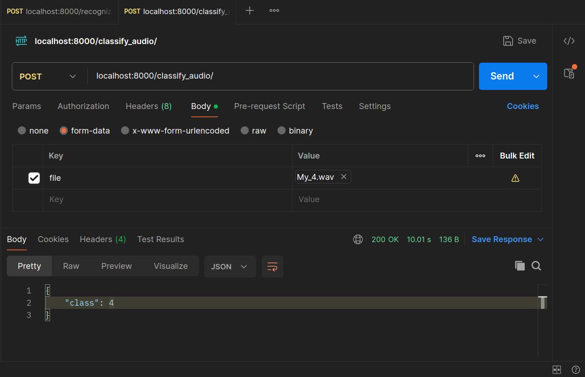

# **Audio Classification Project**

## **Overview**

This project involves developing an audio classification system using spectrograms. The system is built with Python, utilizing FastAPI for creating a REST API and Docker for containerization.  

In the previous assignment (assignment 14\) we trained a model on spectrograms of audio files. The dataset contains 10 folders, each with audio recordings of a specific number being spoken. Trained a sequence of convolutional layers on the spectrograms and then saved the model as a `.keras` file. 

For this project, we converted the `.keras`  model to `.onnx` model, using ‘converting\_to\_onnx.py’ python script. Then created a FastAPI application that uses the `.onnx` model to classify audio files and made it ready for deployment using Docker.

The project consists of these main parts:

1. **Audio Input Handling**: Accepting audio file from user.  
2. **Spectrogram Generation**: Converting uploaded audio into spectrogram.  
3. **Model Inference**: Using the `audio_classification_spectrogram.onnx` model to predict audio class based on spectrogram.  
4. **Prediction Output**: Returning the predicted audio class to the user.

## **Project Structure**

* **main.py**: The FastAPI application script that handles audio file uploads and classification.  
* **requirements.txt**: Lists all Python dependencies required by the project.  
* **Dockerfile**: Instructions for building a Docker image of the application.  
* **audio\_classification\_spectrogram.onnx**: The converted ONNX model used for inference.

## **API Development**

* **FastAPI Application**:  
  * Accepts audio file uploads via the `/classify_audio/` endpoint.  
  * Processes the uploaded audio by converting it into a spectrogram.  
  * Uses the `.onnx` model for inference to predict the class of the audio.  
  * Returns the predicted class as a JSON response.

##  **Usage**

### **Installation**

1. Navigate to the project directory on your system: (bash)  
   `cd [location]/A15_MiniProj_AudioClassification_FastAPI/Project`  
2. Create and activate a virtual environment:  (bash)  
   `python -m virtualenv venv`  
   `` source venv/bin/activate  # On Windows, use `venv\Scripts\activate` ``  
3. Install dependencies:  (bash)  
   `pip install -r requirements.txt`  
   Or just run the following command:  
   `pip install fastapi python-multipart uvicorn onnxruntime numpy librosa tensorflow`  
 

### **Running the API**

1. Start the FastAPI server:  (bash)  
   `uvicorn main:app --host 0.0.0.0 --port 8000`   
   Or just run the python application:  
   `Python main.py`  
2. The API will be available at `http://localhost:8000`

### **API Endpoints**

**POST /classify\_audio**

Accepts an audio file from the user and triggers the classification process.

* **Request**:

  * Method: POST  
  * Content-Type: multipart/form-data  
  * Body:  
    * `file`: Audio file (e.g., WAV, MP3)  
* **Response**: Predicted audio class (JSON)

### **Testing with Postman**

1. Open Postman and create a new POST request to `http://localhost:8000/classify_audio/`  
2. Set the request type to `POST`  
3. In the "Body" tab, select "form-data"  
4. Add a key named "file" and set its type to "File"  
5. Upload an audio file saying a digit in farsi  
6. Send the request and view the response containing the class of the audio (digit being said)  

  
  

In case you preferred to run the project from its `docker container`, read the following:

## **Usage with Docker**

**Dockerfile**:

* Uses the `python:3.12-alpine` base image.  
* Installs dependencies from `requirements.txt`.  
* Copies the `.onnx` model and `main.py` into the container.  
* Sets the command to run `main.py` when the container starts.

1. **Build Docker Image**:

   `docker build -t audio-classification-app .`

2. **`Run Docker Container`**`:`

   `docker run -p 8000:8000 audio-classification-app` 

3. **Test API**:  
   * Use Postman or a similar tool (we used postman) to send a POST request to http://localhost:8000/classify\_audio/ with an audio file attached.  
   * The API will return the predicted class of the audio.

